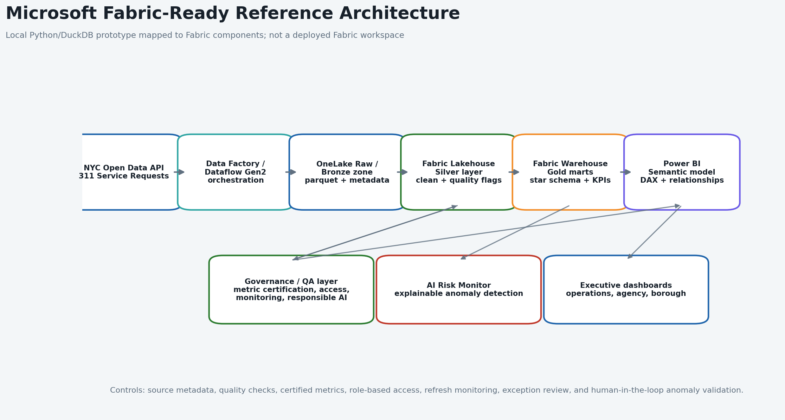
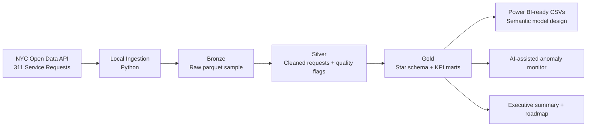

# NYC 311 Service Intelligence Platform

**Senior Consultant portfolio case study:** a local Python/DuckDB/SQL analytics prototype that maps real NYC 311 Service Request data to a **Microsoft Fabric-ready implementation blueprint**, **Power BI-ready semantic model design**, explainable AI/anomaly monitoring, governance controls, and a client adoption roadmap.

This repository is intentionally honest: it has **not** been deployed in Microsoft Fabric, Azure, Power BI Desktop, or Power BI Service. It is a polished local prototype that shows how I would advise, design, and deliver a Fabric-aligned analytics solution for a client.

## Executive Value Proposition

Public-sector operations leaders need to know where service demand is rising, which agencies are exposed to backlog, whether resolution performance is reliable, and which unusual complaint spikes need human review. This project turns public NYC Open Data into a consulting-ready analytics deliverable:

- **Business impact:** backlog triage, agency performance review, complaint demand intelligence, and executive operating cadence.
- **Fabric-ready architecture:** OneLake raw/bronze, Lakehouse silver, Warehouse gold marts, Data Factory/Dataflow Gen2 orchestration, Power BI semantic model.
- **Power BI-ready semantic model:** request-grain fact table, conformed dimensions, DAX measure catalog, QA checklist, and report-page blueprint.
- **AI-assisted monitoring:** explainable anomaly detection using rolling baselines, z-scores, and IQR checks, with human-in-the-loop escalation.
- **Governance and delivery:** metric certification, data-quality controls, responsible AI notes, stakeholder enablement, and 30/60/90-day rollout plan.

## Headline Metrics From Current Sample

The committed sample outputs were generated from a recent **100,000-record** public NYC Open Data extract ingested on **2026-06-15 UTC**. Raw parquet, DuckDB files, and the largest generated CSV extracts are intentionally not committed.

| Metric | Result | Why It Matters |
|---|---:|---|
| Total requests analyzed | 100,000 | Demonstrates scalable local processing on real operational data. |
| Open requests | 27,970 | Indicates active backlog exposure. |
| Backlog rate | 28.0% | Prioritizes queue triage and agency performance review. |
| Average resolution time | 15.5 hours | Supports service-level and workflow analysis. |
| Closed within 7 days | 73.6% | Executive SLA proxy for service responsiveness. |
| Anomalies detected | 15 | Flags unusual borough/complaint spikes for investigation. |
| Data-quality exceptions | 17 invalid date-order rows | Shows validation rather than blind reporting. |

## Architecture Blueprint





## Dashboard Preview

These PNGs are **static previews generated from CSV outputs** by `src/generate_dashboard_mockups.py`. They show dashboard design thinking only. A real Power BI implementation would use the documented semantic model, relationships, and DAX measures in `powerbi/`.

| Preview | Purpose |
|---|---|
|  | Executive Operations Overview: service demand, backlog, resolution, and SLA proxy. |
|  | Agency Performance & Backlog Risk: volume, backlog exposure, and workflow review candidates. |
|  | Borough / Complaint Demand Intelligence: geographic and complaint mix analysis. |
|  | AI Risk & Anomaly Monitor: explainable spike detection and action queue. |

## Why This Project Fits A Data Analytics & AI Senior Consultant Role

| JD Requirement | Project Evidence |
|---|---|
| Microsoft Fabric, OneLake, Lakehouse, Warehouse architecture | `docs/fabric_reference_architecture.md`, `docs/fabric_deployment_guide.md`, architecture blueprint PNG |
| Data Factory / orchestration and scalable ETL/ELT | `Makefile`, `src/ingest_311.py`, SQL medallion folders, Fabric pipeline mapping |
| Power BI semantic modeling and dashboard development | `powerbi/README.md`, `powerbi/dax_measures.md`, dashboard mockups |
| AI-driven automation, anomaly detection, predictive analytics mindset | `src/anomaly_detection.py`, `outputs/sample_dashboard_data/anomalies.csv`, AI Risk mockup |
| Data accuracy, consistency, reliability | `src/quality_checks.py`, `docs/data_quality.md`, `outputs/insights/data_quality_report.md` |
| Governance, compliance, security, responsible AI | `docs/data_governance_responsible_ai.md` |
| Client advisory and stakeholder communication | `outputs/insights/executive_summary.md`, `docs/consulting_case_study.md`, `docs/senior_consultant_role_alignment.md` |
| Implementation roadmap and project delivery | `docs/client_implementation_roadmap.md`, `docs/client_enablement_training_plan.md` |
| Training, adoption, and knowledge transfer | `docs/client_enablement_training_plan.md`, `docs/interview_talk_track.md` |

## Key Insights

- **Backlog triage is the primary management opportunity.** The current sample shows a 28.0% open-request rate.
- **Demand is concentrated.** Illegal Parking is the highest-volume complaint category with 16,538 requests.
- **Brooklyn carries the largest demand load.** Brooklyn has 31,128 requests in the current sample.
- **Anomaly monitoring adds early-warning value.** The sample flagged Water System, Sewer, Traffic Signal Condition, and related spikes across boroughs on 2026-06-11 and 2026-06-12.
- **Quality controls protect KPI trust.** Most validation rules pass, but 17 invalid date-order rows should be reviewed before certifying resolution-time metrics.

## Quick Start

```bash
python -m venv .venv
source .venv/bin/activate
make install
make all LIMIT=100000
```

Equivalent manual commands:

```bash
python src/ingest_311.py --limit 100000
python src/transform_311.py
python src/quality_checks.py
python src/anomaly_detection.py
python src/generate_insights.py
python src/generate_dashboard_mockups.py
```

## Data Source

- Dataset: **311 Service Requests from 2020 to Present**
- Dataset ID: `erm2-nwe9`
- Publisher: **NYC Open Data**
- Source page: https://data.cityofnewyork.us/Social-Services/311-Service-Requests-from-2020-to-Present/erm2-nwe9

## Repository Guide

- `src/`: ingestion, transformation orchestration, quality checks, anomaly detection, insight generation, dashboard mockup generation.
- `sql/`: bronze, silver, and gold SQL transformations.
- `powerbi/`: semantic model design, relationship guidance, DAX measures, validation checklist.
- `docs/`: Fabric blueprint, governance, client roadmap, enablement plan, interview talk track, scorecard.
- `outputs/`: committed sample KPI/anomaly outputs and consulting summaries.

## Important Truthfulness Notes

- This is a **local prototype that maps to Fabric components**.
- The repo contains a **Power BI-ready semantic model design**, not a `.pbix` file.
- The anomaly detector is **explainable statistical monitoring / AI-assisted analytics**, not a black-box LLM or Azure ML deployment.
- A real client implementation would require Fabric workspace configuration, security setup, refresh scheduling, stakeholder UAT, and Power BI report development.
