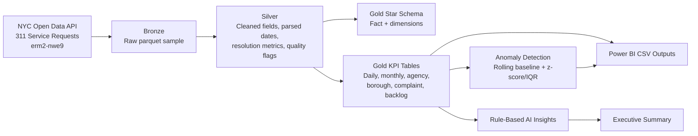

# NYC 311 Service Intelligence Platform

An end-to-end analytics engineering and AI consulting portfolio project using public NYC 311 Service Request data. The project turns raw service requests into a Microsoft Fabric-style medallion architecture, Power BI-ready star schema, data-quality report, anomaly monitor, and executive consulting recommendations.

## Why This Matters

City service teams and public-sector consultants need to understand where demand is rising, which agencies face backlog risk, and which complaint categories require operational attention. This project demonstrates how a data analytics and AI consultant can convert public operational data into a governed reporting asset and practical client recommendations.

## Architecture



## Data Source

- Dataset: **311 Service Requests from 2020 to Present**
- Dataset ID: `erm2-nwe9`
- Publisher: **NYC Open Data**
- Source page: https://data.cityofnewyork.us/Social-Services/311-Service-Requests-from-2020-to-Present/erm2-nwe9

The ingestion script downloads a manageable recent sample by default. Large raw and processed files are intentionally ignored by git.

## Project Structure

```text
.
├── data/
│   ├── raw/                 # gitkeep only; generated raw files are ignored
│   └── processed/           # gitkeep only; generated DuckDB files are ignored
├── docs/
├── outputs/
│   ├── insights/
│   └── sample_dashboard_data/
├── powerbi/
├── sql/
│   ├── bronze/
│   ├── silver/
│   └── gold/
└── src/
```

## Setup

```bash
python -m venv .venv
source .venv/bin/activate
pip install -r requirements.txt
```

## Run the Pipeline

Use the default 100,000-record sample:

```bash
python src/ingest_311.py --limit 100000
python src/transform_311.py
python src/quality_checks.py
python src/anomaly_detection.py
python src/generate_insights.py
```

Use a larger sample by changing the limit:

```bash
python src/ingest_311.py --limit 300000
```

## Outputs

Power BI-ready CSV files are written to `outputs/sample_dashboard_data/`, including:

- `fact_service_requests.csv`
- `dim_date.csv`
- `dim_agency.csv`
- `dim_borough.csv`
- `dim_complaint_type.csv`
- `dim_location.csv`
- `daily_request_kpis.csv`
- `monthly_request_kpis.csv`
- `agency_performance_kpis.csv`
- `borough_service_kpis.csv`
- `complaint_type_kpis.csv`
- `backlog_kpis.csv`
- `anomalies.csv`

Insight outputs are written to `outputs/insights/`:

- `executive_summary.md`
- `anomaly_summary.md`
- `data_quality_report.md`
- `data_quality_report.csv`

## Business KPIs

The gold layer calculates:

- Total requests, open requests, and closed requests
- Backlog rate
- Average and median resolution hours
- Percent closed within 24 hours and within 7 days
- Top complaint types and agencies by volume
- Borough-level request volume
- Month-over-month request growth
- Agency/borough combinations with high backlog risk

## AI and Analytics Layer

The anomaly detector flags unusual daily spikes by borough and complaint type using explainable rolling baselines:

- Prior 14-day rolling mean and z-score
- Prior 28-day interquartile range
- Plain-English recommended action for each anomaly

The executive summary generator uses transparent rules instead of an external LLM API. It turns KPI outputs into client-facing recommendations such as backlog triage, root-cause review, workflow review, and weekly monitoring.

## Dashboard Mockup

The Power BI design is documented in `docs/dashboard_design.md` as four pages:

1. Executive Overview
2. Agency Performance
3. Borough & Complaint Analysis
4. AI Risk & Anomaly Monitor

See `powerbi/README.md` for import steps and `powerbi/dax_measures.md` for semantic model measures.

## Microsoft Fabric Mapping

This is a local project with a Fabric-ready implementation guide. The mapping is documented in `docs/fabric_deployment_guide.md`:

- OneLake/Lakehouse for bronze and silver data
- Warehouse or Lakehouse SQL endpoint for gold tables
- Data Factory Pipeline or Dataflow Gen2 for ingestion
- Fabric Notebook for Python transformation and anomaly detection
- Power BI semantic model and report
- Dev/test/prod deployment pipeline concept

## Skills Demonstrated

- Python ingestion from a public API
- SQL transformation and analytics engineering in DuckDB
- Medallion architecture: bronze, silver, gold
- Star schema modeling for Power BI
- Data quality validation and exception reporting
- KPI design for operational analytics
- Explainable anomaly detection
- Rule-based AI insight generation
- Microsoft Fabric architecture mapping
- Client-facing documentation and business recommendations

## Role Fit: Data Analytics & AI Consultant

This project is designed to be discussed in an entry-level consulting interview. It shows how to translate a client problem into a working analytics product, validate the data, design Power BI-ready outputs, explain AI methods clearly, and recommend practical operational actions.
