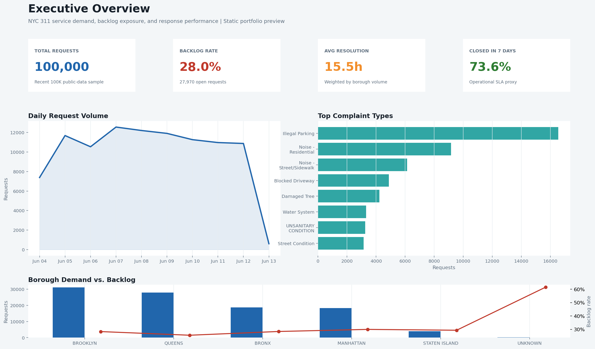
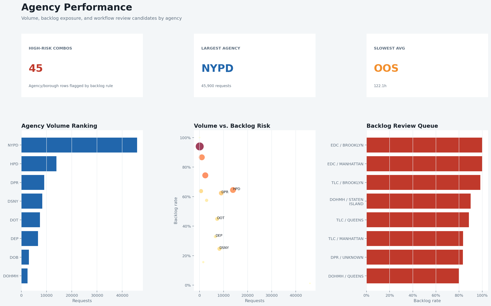
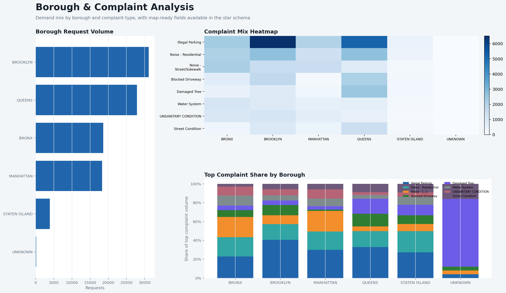
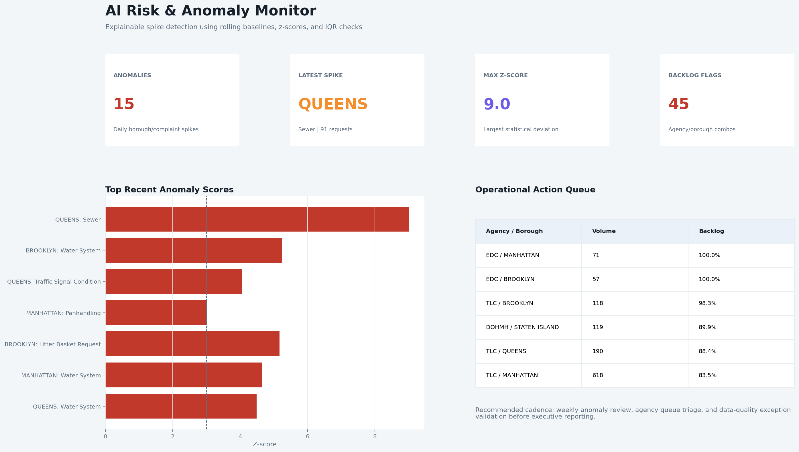
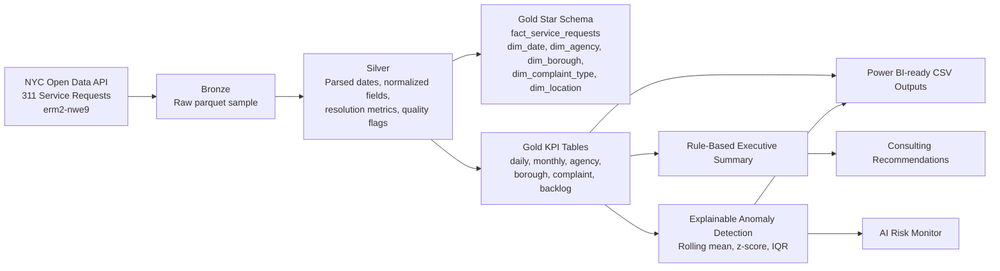

# NYC 311 Service Intelligence Platform

**Consulting portfolio case study:** turning public NYC 311 service-request data into a Fabric-ready analytics architecture, Power BI-ready model, explainable anomaly monitor, and executive operating recommendations.

This project is designed for a **Consultant, Data Analytics & AI** interview. It shows how I would help a client move from raw operational data to a practical decision-support product: governed metrics, quality checks, dashboard design, and AI-assisted risk monitoring.

## Executive Value Proposition

City service leaders need to know where demand is rising, which teams are exposed to backlog, and which complaint spikes need action before they become service failures. This project uses public NYC Open Data to build a repeatable local analytics pipeline that answers those questions with transparent SQL, Python, and Power BI-ready outputs.

**What a client gets:**

- A medallion data model that separates raw ingestion, cleaned service requests, and certified KPI outputs.
- A Power BI-ready star schema for request-level drilldown and executive KPI reporting.
- Explainable anomaly detection for daily complaint spikes by borough and complaint type.
- Consulting-style recommendations, implementation roadmap, and data-quality notes.
- A Fabric-ready guide that maps the local implementation to OneLake, Lakehouse/Warehouse, notebooks, Data Factory/Dataflow Gen2, and Power BI.

## Headline Metrics From Current Sample

The committed sample outputs were generated from a recent **100,000-record** public NYC Open Data extract ingested on **2026-06-15 UTC**. Raw parquet and DuckDB files are intentionally not committed.

| Metric | Result | Why It Matters |
|---|---:|---|
| Total requests analyzed | 100,000 | Demonstrates scalable local processing on real operational data. |
| Open requests | 27,970 | Indicates active backlog exposure. |
| Backlog rate | 28.0% | Prioritizes queue triage and agency performance review. |
| Average resolution time | 15.5 hours | Supports service-level and workflow analysis. |
| Closed within 7 days | 73.6% | Executive SLA proxy for service responsiveness. |
| Anomalies detected | 15 | Flags unusual borough/complaint spikes for investigation. |
| Data-quality exceptions | 17 invalid date-order rows | Shows validation rather than blind reporting. |

## Dashboard Preview

These PNGs are static dashboard mockups generated from the CSV outputs with `src/generate_dashboard_mockups.py`. They are **not** Power BI exports. They preview the intended report experience for recruiters and interviewers.

### Executive Overview



### Agency Performance



### Borough & Complaint Analysis



### AI Risk & Anomaly Monitor



## Key Insights

- **Backlog triage is the main management theme.** The current sample shows a 28.0% open-request rate, which is high enough to justify agency-level queue review.
- **Demand is concentrated.** Illegal Parking is the highest-volume complaint category with 16,538 requests.
- **Brooklyn carries the largest demand load.** Brooklyn has 31,128 requests in the current sample.
- **Some complaint categories have operational risk beyond volume.** Damaged Tree, UNSANITARY CONDITION, and Street Condition show materially higher backlog or resolution-time exposure than high-volume noise and parking categories.
- **Anomaly monitoring adds early-warning value.** The sample flagged Water System, Sewer, Traffic Signal Condition, and related spikes across boroughs on 2026-06-11 and 2026-06-12.
- **The quality layer matters.** Most validation rules pass, but 17 invalid date-order rows should be resolved before certifying resolution-time metrics.

## Architecture



## Repository Structure

```text
.
├── data/
│   ├── raw/                         # gitkeep only; generated raw files ignored
│   └── processed/                   # gitkeep only; generated DuckDB ignored
├── docs/
│   ├── dashboard_mockups/           # static PNG previews generated from CSV outputs
│   ├── consulting_case_study.md
│   ├── client_implementation_roadmap.md
│   ├── fabric_deployment_guide.md
│   ├── interview_talk_track.md
│   └── project_review_scorecard.md
├── outputs/
│   ├── insights/                    # committed consulting summaries and QA report
│   └── sample_dashboard_data/       # committed small KPI/anomaly CSV samples
├── powerbi/
│   ├── README.md
│   └── dax_measures.md
├── sql/
│   ├── bronze/
│   ├── silver/
│   └── gold/
├── src/
└── Makefile
```

## Data Source

- Dataset: **311 Service Requests from 2020 to Present**
- Dataset ID: `erm2-nwe9`
- Publisher: **NYC Open Data**
- Source page: https://data.cityofnewyork.us/Social-Services/311-Service-Requests-from-2020-to-Present/erm2-nwe9

The ingestion script downloads a recent sample by default and preserves source metadata in `data/raw/source_metadata.json` when run locally.

## Quick Start

```bash
python -m venv .venv
source .venv/bin/activate
make install
make all LIMIT=100000
```

Equivalent manual commands:

```bash
python src/ingest_311.py --limit 100000
python src/transform_311.py
python src/quality_checks.py
python src/anomaly_detection.py
python src/generate_insights.py
python src/generate_dashboard_mockups.py
```

Use a larger sample by changing `LIMIT`, for example:

```bash
make all LIMIT=300000
```

## Core Outputs

Power BI-ready CSVs are written to `outputs/sample_dashboard_data/`. The committed repo includes small sample KPI outputs and anomaly outputs. Large generated extracts such as `fact_service_requests.csv` and `dim_location.csv` are ignored by git and can be regenerated locally.

Insight outputs are written to `outputs/insights/`:

- `executive_summary.md`
- `anomaly_summary.md`
- `data_quality_report.md`
- `data_quality_report.csv`

Dashboard mockups are written to `docs/dashboard_mockups/`.

## Power BI And Fabric Readiness

- `powerbi/README.md` explains table imports, model relationships, semantic-model notes, and QA checks.
- `powerbi/dax_measures.md` documents measures for total requests, backlog rate, resolution hours, SLA proxies, anomaly counts, and backlog flags.
- `docs/fabric_deployment_guide.md` maps the local project to Microsoft Fabric components.

Important: this repository is **Fabric-ready** and **Power BI-ready**, but it does not claim that the project has been deployed in Fabric or built as a native `.pbix` report.

## Consulting Deliverables

- [Executive summary](outputs/insights/executive_summary.md)
- [Consulting case study](docs/consulting_case_study.md)
- [Client implementation roadmap](docs/client_implementation_roadmap.md)
- [Interview talk track](docs/interview_talk_track.md)
- [Project review scorecard](docs/project_review_scorecard.md)
- [Dashboard design](docs/dashboard_design.md)
- [Data quality framework](docs/data_quality.md)

## Skills Demonstrated

- Public API ingestion with Python
- Local ELT with DuckDB and SQL
- Medallion architecture design
- Star schema modeling for Power BI
- KPI design for service operations
- Data-quality validation and exception reporting
- Explainable anomaly detection
- Static dashboard preview generation
- Microsoft Fabric implementation mapping
- Consulting-style executive communication

## Role Fit

For a **Consultant, Data Analytics & AI** role, this project demonstrates the full consulting loop:

1. Frame the client problem.
2. Build a reliable data pipeline.
3. Model business-ready metrics.
4. Validate data quality.
5. Design executive dashboards.
6. Add explainable AI monitoring.
7. Translate findings into a 30-day client action plan.
