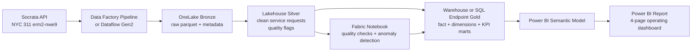

# Microsoft Fabric-Ready Implementation Guide

This repository runs locally with Python, DuckDB, SQL, and CSV exports. The design is intentionally **Fabric-ready**, but it has not been deployed to Microsoft Fabric in this repo. The guidance below explains how a client implementation could map the local pattern to Fabric.

## Local-To-Fabric Mapping

| Local Component | Fabric Equivalent | Purpose |
|---|---|---|
| `src/ingest_311.py` | Data Factory Pipeline or Dataflow Gen2 | Parameterized Socrata API ingestion. |
| `data/raw/nyc_311_raw.parquet` | OneLake Lakehouse bronze files | Preserve raw public-data extracts and metadata. |
| `sql/silver/` | Fabric Notebook, Spark SQL, or SQL endpoint transform | Normalize fields, parse dates, calculate resolution metrics, and add quality flags. |
| `sql/gold/` | Warehouse or Lakehouse SQL endpoint | Publish star schema and KPI marts. |
| `src/quality_checks.py` | Fabric Notebook or scheduled data-quality job | Produce QA report and exception counts. |
| `src/anomaly_detection.py` | Fabric Notebook scheduled job | Produce explainable anomaly events. |
| `outputs/sample_dashboard_data/` | Power BI semantic model over Fabric tables | Local CSV handoff for portfolio review; Fabric would serve tables directly. |

## Target Architecture

## Recommended Fabric Build Plan

### Bronze Layer

- Store raw files by ingestion date.
- Persist source metadata: dataset ID, API URL, ingestion timestamp, requested limit, and record count.
- Avoid overwriting raw extracts so quality issues can be audited later.

### Silver Layer

- Standardize field names and data types.
- Parse `created_date` and `closed_date`.
- Normalize borough, agency, complaint type, and status.
- Calculate `resolution_hours`.
- Add flags for missing close date, invalid date order, missing borough, and duplicate unique keys.

### Gold Layer

- Publish `fact_service_requests` at request grain.
- Publish conformed dimensions: date, agency, borough, complaint type, and location.
- Publish KPI marts for dashboard performance and QA:
  - `daily_request_kpis`
  - `monthly_request_kpis`
  - `agency_performance_kpis`
  - `borough_service_kpis`
  - `complaint_type_kpis`
  - `backlog_kpis`

### Power BI Semantic Model

- Use the request-grain fact table for certified measures.
- Keep aggregated KPI tables for performance testing and QA comparisons.
- Create a certified measure catalog for backlog, resolution, closure, anomaly, and risk metrics.
- Mark the date table and hide surrogate keys.

## Deployment Pipeline Concept

Use separate Fabric workspaces for dev, test, and prod.

| Stage | Purpose | Promotion Gate |
|---|---|---|
| Dev | Build and iterate on ingestion, transformations, and measures. | Unit checks pass on sample data. |
| Test | Validate full refresh, data quality, and report behavior. | Stakeholder signoff on KPI definitions. |
| Prod | Serve certified dashboard and scheduled refresh. | Refresh monitoring and support ownership in place. |

## QA And Monitoring Checklist

- Ingestion row count matches source API response count.
- Duplicate `unique_key` count is reviewed.
- Invalid date-order count is below agreed threshold or excluded from certified resolution metrics.
- Open request logic is reviewed with business owners.
- Power BI totals reconcile to gold table counts.
- Scheduled anomaly outputs are reviewed before alerting stakeholders.
- Refresh failures are logged and routed to an owner.
- Fabric capacity and refresh duration are monitored after moving beyond a sample extract.

## Honest Portfolio Wording

Recommended phrasing:

- "Designed a Fabric-ready architecture."
- "Mapped local DuckDB/SQL layers to Fabric Lakehouse/Warehouse patterns."
- "Prepared Power BI-ready exports and DAX measure documentation."

Avoid claiming:

- "Deployed to Fabric."
- "Published a Power BI report."
- "Configured production refresh."

Those claims should only be added after actual Fabric and Power BI artifacts exist.
