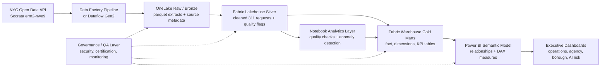

# Fabric Reference Architecture

This document describes a realistic Microsoft Fabric target architecture for the NYC 311 Service Intelligence Platform. The repository itself remains a local Python/DuckDB/SQL prototype.

## Architecture Summary

## Current Local Artifact To Fabric Component Mapping

| Current Local Artifact | Fabric Component | Purpose |
|---|---|---|
| `src/ingest_311.py` | Data Factory Pipeline, Dataflow Gen2, or Fabric Notebook | Parameterized extraction from NYC Open Data. |
| `data/raw/nyc_311_raw.parquet` generated locally | OneLake Raw / Bronze | Preserve raw records and source metadata. |
| `sql/silver/01_create_silver_service_requests.sql` | Fabric Lakehouse Silver table | Clean fields, parse dates, add resolution metrics and quality flags. |
| `sql/gold/*.sql` | Fabric Warehouse Gold marts | Publish star schema and KPI tables for analytics. |
| `src/quality_checks.py` | Fabric Notebook quality job | Persist data-quality results and exception counts. |
| `src/anomaly_detection.py` | Fabric Notebook analytics job | Write explainable anomaly events for Power BI consumption. |
| `powerbi/README.md` and `powerbi/dax_measures.md` | Power BI semantic model | Define relationships, DAX measures, and validation checklist. |
| `docs/dashboard_mockups/*.png` | Power BI report page blueprint | Static previews only; real implementation would rebuild visuals in Power BI. |

## OneLake Raw / Bronze Zone

Purpose:

- Preserve public NYC 311 extracts in their original shape where practical.
- Store source metadata for lineage and auditability.
- Avoid destructive overwrites so historical refreshes can be investigated.

Recommended design:

- Partition by ingestion date.
- Store API URL, dataset ID, requested limit, record count, and ingestion timestamp.
- Keep source landing separate from cleaned reporting tables.

## Fabric Lakehouse Silver Layer

Purpose:

- Normalize fields and prepare request-level records for analytics.
- Apply data-quality flags without hiding exceptions.

Silver transformations:

- Parse `created_date` and `closed_date`.
- Normalize borough, agency, complaint type, and status.
- Calculate `resolution_hours`.
- Flag missing close date, invalid date order, missing borough, and duplicate `unique_key`.

## Fabric Warehouse Gold Marts

Purpose:

- Serve governed reporting and reusable KPI logic.
- Separate request-grain facts from aggregate KPI tables.

Gold outputs:

- `fact_service_requests`
- `dim_date`
- `dim_agency`
- `dim_borough`
- `dim_complaint_type`
- `dim_location`
- `daily_request_kpis`
- `monthly_request_kpis`
- `agency_performance_kpis`
- `borough_service_kpis`
- `complaint_type_kpis`
- `backlog_kpis`

## Data Factory Or Dataflow Gen2 Orchestration

Recommended orchestration:

1. Parameterized API extract from NYC Open Data.
2. Land raw extract and metadata in OneLake.
3. Run silver transformation.
4. Run quality checks and write exception outputs.
5. Run gold transformations.
6. Run anomaly detection.
7. Refresh Power BI semantic model.
8. Notify owners if quality or refresh thresholds fail.

## Power BI Semantic Model

The semantic model should use the request-grain fact table for certified measures and the dimensions for slicing. Aggregated KPI tables can support QA, performance tests, or summary pages, but should not replace certified DAX without clear grain documentation.

Controls:

- Mark `dim_date` as the date table.
- Hide surrogate keys.
- Create display folders for service KPIs, quality metrics, and anomaly measures.
- Certify measures for backlog rate, resolution hours, and closure rate.

## AI / Anomaly Monitoring Layer

The current anomaly detection is explainable statistical monitoring:

- Prior 14-day rolling mean and z-score.
- Prior 28-day IQR threshold.
- Minimum volume threshold.
- Recommended action text generated from rules.

In Fabric, this could run as a scheduled notebook that writes anomaly events to a gold table consumed by Power BI.

## Governance And Security Controls

Recommended controls:

- Workspace roles for developers, analysts, viewers, and admins.
- Separation of dev/test/prod workspaces.
- Certified semantic model for executive reporting.
- Data-quality thresholds before dashboard refresh certification.
- Refresh monitoring and incident ownership.
- Human review before anomaly-driven operational escalation.

## Monitoring And Refresh Cadence

Suggested cadence:

- Daily ingestion and gold refresh.
- Daily quality report.
- Daily anomaly event generation.
- Weekly backlog and anomaly review.
- Monthly executive trend review.

## Cost And Performance Considerations

- Start with incremental ingestion rather than full reloads.
- Partition raw and silver tables by date.
- Push reusable aggregations into gold marts where report performance requires it.
- Monitor Fabric capacity, refresh duration, and semantic model size.
- Avoid overengineering advanced ML until the baseline operational monitoring process is adopted.
