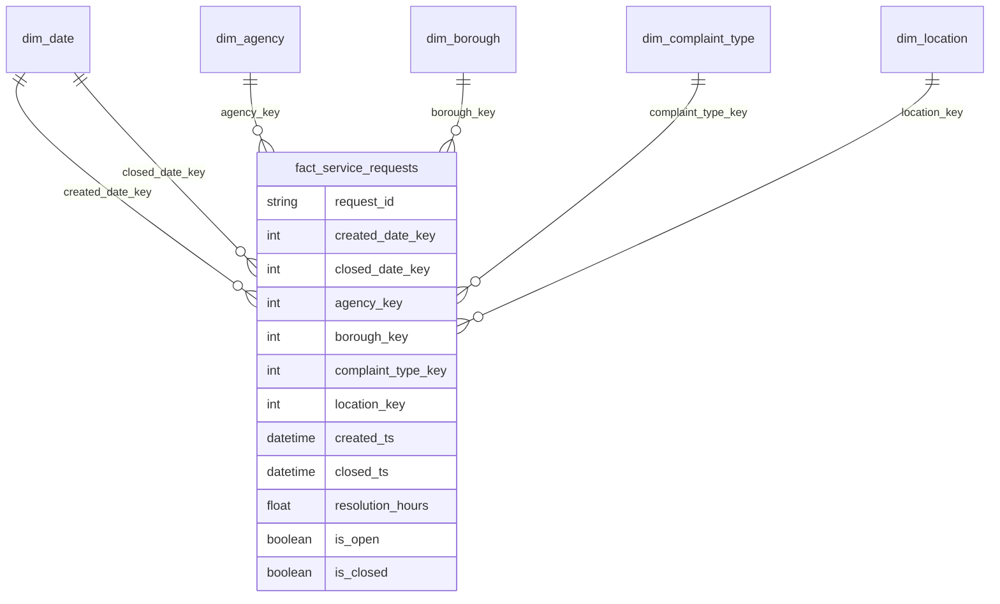

# Power BI Implementation Guide

This folder documents how to turn the local CSV outputs into a Power BI semantic model and report. The repository includes Power BI-ready tables, relationship guidance, DAX measures, validation notes, and static dashboard mockups. It does **not** include a native `.pbix` file or a Power BI Service deployment.

## Import Scope

Run the pipeline first:

```bash
make all LIMIT=100000
```

Then import CSV files from `outputs/sample_dashboard_data/`.

Recommended import tables:

- `fact_service_requests.csv`
- `dim_date.csv`
- `dim_agency.csv`
- `dim_borough.csv`
- `dim_complaint_type.csv`
- `dim_location.csv`
- `daily_request_kpis.csv`
- `monthly_request_kpis.csv`
- `agency_performance_kpis.csv`
- `borough_service_kpis.csv`
- `complaint_type_kpis.csv`
- `backlog_kpis.csv`
- `anomalies.csv`

Note: the GitHub repo may not commit the largest generated extracts. Run the pipeline locally to regenerate any missing CSVs.

## Recommended Star Schema



Relationship settings:

| From | To | Cardinality | Cross-filter |
|---|---|---|---|
| `fact_service_requests[created_date_key]` | `dim_date[date_key]` | Many-to-one | Single |
| `fact_service_requests[agency_key]` | `dim_agency[agency_key]` | Many-to-one | Single |
| `fact_service_requests[borough_key]` | `dim_borough[borough_key]` | Many-to-one | Single |
| `fact_service_requests[complaint_type_key]` | `dim_complaint_type[complaint_type_key]` | Many-to-one | Single |
| `fact_service_requests[location_key]` | `dim_location[location_key]` | Many-to-one | Single |

Keep `closed_date_key` inactive unless you need closed-date reporting. Use `USERELATIONSHIP` for closed-date-specific measures.

## Semantic Model Notes

- Mark `dim_date[date_day]` as the date table.
- Hide surrogate keys from report users after relationships are created.
- Keep KPI measures in a dedicated display folder such as `Service KPIs`.
- Format rates as percentages and resolution hours with one decimal place.
- Use request-grain measures from `fact_service_requests` for certified reporting.
- Use aggregated KPI CSVs for quick prototyping, QA, and dashboard-performance testing.
- Do not mix request-grain fact measures with pre-aggregated KPI table measures in the same visual unless the grain is clear.
- Document each certified measure with owner, definition, grain, null handling, and validation query.
- Keep anomaly tables separate from certified operational KPIs unless a relationship strategy is intentionally designed.

## Report Page Design

1. **Executive Operations Overview**
   - KPI cards: total requests, backlog rate, average resolution hours, closed within 7 days.
   - Trend visual: request volume by day or month.
   - Bar charts: top complaint types and borough volume.
   - Intended audience: executives and service operations leaders.

2. **Agency Performance & Backlog Risk**
   - Agency ranking by volume, backlog rate, resolution hours, and 7-day closure rate.
   - High-risk agency/borough matrix from `backlog_kpis`.
   - Scatter plot: volume versus backlog rate.
   - Intended audience: agency managers and operational improvement teams.

3. **Borough / Complaint Demand Intelligence**
   - Borough comparison.
   - Complaint mix by borough.
   - Map using latitude/longitude from `dim_location` and the request fact table.
   - Intended audience: analysts, borough teams, and planning stakeholders.

4. **AI Risk & Anomaly Monitor**
   - Anomaly table from `anomalies.csv`.
   - Daily trend with anomaly markers.
   - Recommended action text.
   - Intended audience: analysts and operations owners reviewing unusual spikes.

## Executive Vs. Analyst View Design

Executive view:

- Use certified KPI cards, simple trend visuals, and action-oriented callouts.
- Avoid request-level detail by default.
- Include data-quality caveats in a concise notes panel.

Analyst view:

- Include slicers for borough, agency, complaint type, and date.
- Provide drillthrough to request-level fields when privacy and governance allow.
- Add QA comparison visuals using aggregate KPI tables.
- Show anomaly methodology notes and threshold fields.

## AI Risk Monitor Page Design

The AI page should make the method and action workflow clear:

- Show anomaly date, borough, complaint type, total requests, rolling baseline, z-score, and recommended action.
- Use a visible threshold reference line for z-score.
- Add a "requires human review" status field in a real implementation.
- Avoid language that implies automated decisioning.
- Include a link or tooltip explaining rolling mean, z-score, and IQR logic.

## QA Checklist

Before presenting the report:

- Confirm total requests in Power BI equals the pipeline row count.
- Confirm open requests plus closed requests equals total requests.
- Confirm backlog rate equals open requests divided by total requests.
- Confirm average resolution excludes open requests with null resolution hours.
- Confirm date filters affect fact-based measures as expected.
- Confirm borough, agency, and complaint slicers filter all visuals.
- Confirm anomaly rows match `outputs/sample_dashboard_data/anomalies.csv`.
- Confirm data-quality exceptions are visible in notes or a QA appendix.
- Confirm no visual claims deployment in Fabric or Power BI Service unless actually deployed.
- Confirm static mockups are labeled as previews, not screenshots from Power BI.
- Confirm imported CSV row counts match the generated files.

## Power BI Service / Fabric Workspace Notes

If implemented in a real client workspace:

- Replace CSV imports with Fabric Lakehouse/Warehouse tables where possible.
- Configure scheduled refresh and ownership.
- Use deployment pipelines for dev/test/prod promotion.
- Apply workspace roles and security groups.
- Promote or certify the semantic model only after KPI signoff.
- Add refresh monitoring and failure notifications.
- Document report endorsement, support ownership, and change-control process.

## Dashboard Mockups

Static PNG mockups live in `docs/dashboard_mockups/`. They are generated from the CSV outputs using:

```bash
make dashboard-mockups
```

These images are intended for portfolio review only. They are not Power BI screenshots, and they are not evidence of a deployed report.
